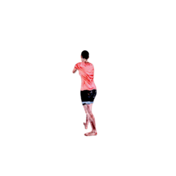
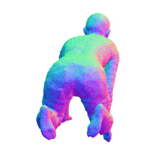

# A-NeRF: Articulated Neural Radiance Fields for Learning Human Shape, Appearance, and Pose
### [Paper](https://arxiv.org/abs/2102.06199) | [Website](https://lemonatsu.github.io/anerf/) | [Data](data/)

>**A-NeRF: Articulated Neural Radiance Fields for Learning Human Shape, Appearance, and Pose**\
>[Shih-Yang Su](https://lemonatsu.github.io/), [Frank Yu](https://yu-frank.github.io/), [Michael Zollhoefer](https://zollhoefer.com/), and [Helge Rhodin](http://helge.rhodin.de/)\
>Thirty-Fifth Conference on Neural Information Processing Systems (NeurIPS 2021)

## Update
- Jan 10, 2022: update reference code for multiview pose optimization with uncalibrated cameras.

## Setup

### Setup environment
```
conda create -n anerf python=3.8
conda activate anerf

# install pytorch for your corresponding CUDA environments
pip install torch

# install pytorch3d: note that doing `pip install pytorch3d` directly may install an older version with bugs.
# be sure that you specify the version that matches your CUDA environment. See: https://github.com/facebookresearch/pytorch3d
pip install pytorch3d -f https://dl.fbaipublicfiles.com/pytorch3d/packaging/wheels/py38_cu102_pyt190/download.html

# install other dependencies
pip install -r requirements.txt

```
### Download pre-processed data and pre-trained models
We provide pre-processed data in `.h5` format, as well as pre-trained characters for SURREAL and Mixamo dataset. 

Please see [data/README.md](data/) for details.

## Testing
You can use [`run_render.py`](run_render.py) to render the learned models under different camera motions, or retarget the character to different poses by
```
python run_render.py --nerf_args logs/surreal_model/args.txt --ckptpath logs/surreal_model/150000.tar \
                     --dataset surreal --entry hard --render_type bullet --render_res 512 512 \
                     --white_bkgd --runname surreal_bullet
```
Here, 
- `--dataset` specifies the data source for poses, 
- `--entry` specifices the particular subset from the dataset to render, 
- `--render_type` defines the camera motion to use, and
- `--render_res` specifies the height and width of the rendered images.

Therefore, the above command will render 512x512 the learned SURREAL character with bullet-time effect like the following (resizsed to 256x256):



The output can be found in `render_output/surreal_bullet/`.
	
You can also extract mesh for the learned character:
```
python run_render.py --nerf_args logs/surreal_model/args.txt --ckptpath logs/surreal_model/150000.tar \
                     --dataset surreal --entry hard --render_type mesh --runname surreal_mesh
```
You can find the extracted `.ply` files in `render_output/surreal_mesh/meshes/`.

To render the mesh as in the paper, run
```
python render_mesh.py --expname surreal_mesh 
```
which will output the rendered images in `render_output/surreal_mesh/mesh_render/` like the following:



You can change the setting in [`run_render.py`](run_render.py) to create your own rendering configuration.


## Training
We provide template training configurations in `configs/` for different settings. 

To train A-NeRF on our pre-processed SURREAL dataset,
```
python run_nerf.py --config configs/surreal/surreal.txt --basedir logs  --expname surreal_model
```
The trained weights and log can be found in ```logs/surreal_model```.

To train A-NeRF on our pre-processed Mixamo dataset with estimated poses, run
```
python run_nerf.py --config configs/mixamo/mixamo.txt --basedir log_mixamo/ --num_workers 8 --subject archer --expname mixamo_archer
```
This will train A-NeRF on Mixamo Archer with pose refinement for 500k iterations, with 8 worker threads for the dataloader. 

You can also add `--use_temp_loss --temp_coef 0.05` to optimize the pose with temporal constraint. 

Additionally, you can specify `--opt_pose_stop 200000` to stop the pose refinement at 200k iteraions to only optimize the body models for the remaining iterations.

To finetune the learned model, run
```
python run_nerf.py --config configs/mixamo/mixamo_finetune.txt --finetune --ft_path log_mixamo/mixamo_archer/500000.tar --expname mixamo_archer_finetune
```
This will finetune the learned Mixamo Archer for 200k with the already refined poses. Note that the pose will not be updated during this time.


## Citation
```
@inproceedings{su2021anerf,
    title={A-NeRF: Articulated Neural Radiance Fields for Learning Human Shape, Appearance, and Pose},
    author={Su, Shih-Yang and Yu, Frank and Zollh{\"o}fer, Michael and Rhodin, Helge},
    booktitle = {Advances in Neural Information Processing Systems},
    year={2021}
}
```
## Acknowledgements
- The code is built upon [nerf-pytorch](https://github.com/yenchenlin/nerf-pytorch).
- We use [SPIN](https://github.com/nkolot/SPIN) for estimating the initial 3D poses for our Mixamo dataset.
- We generate the data using [SURREAL](https://github.com/gulvarol/surreal) and [Adobe Mixamo](https://www.mixamo.com/) characters.
